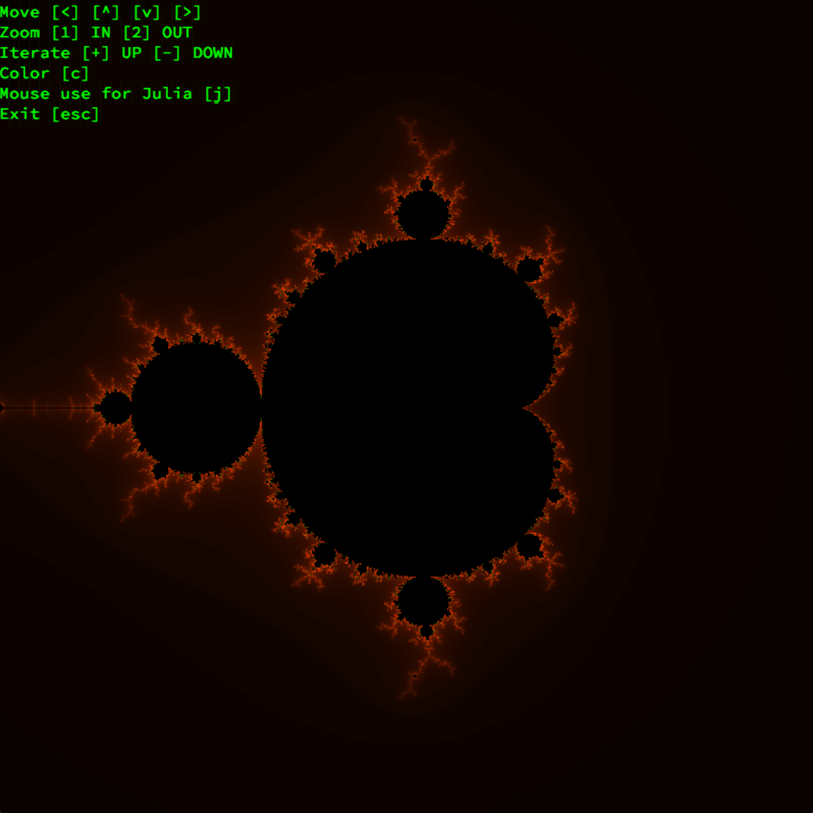
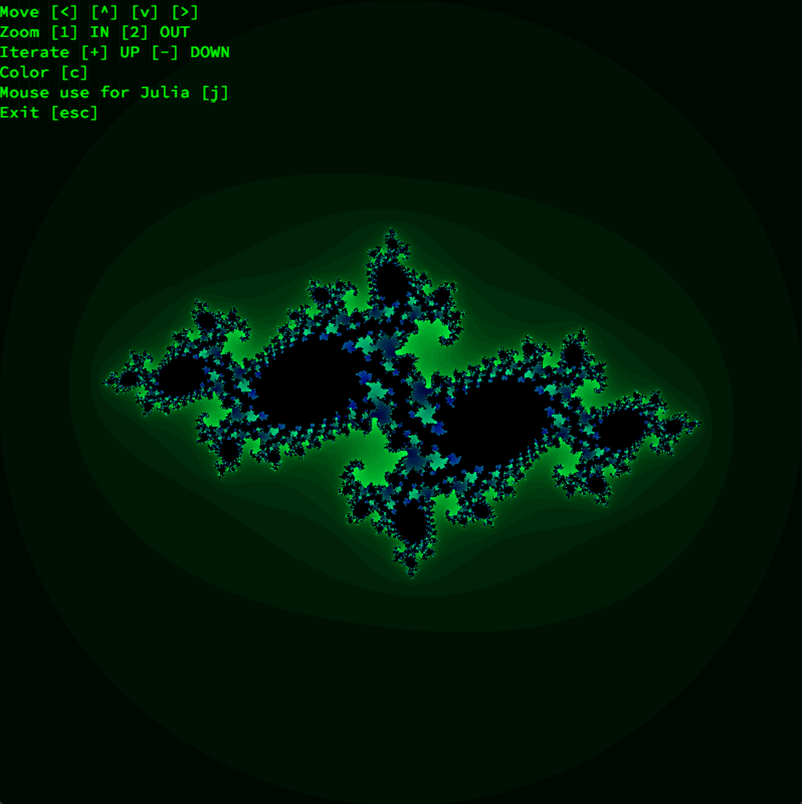
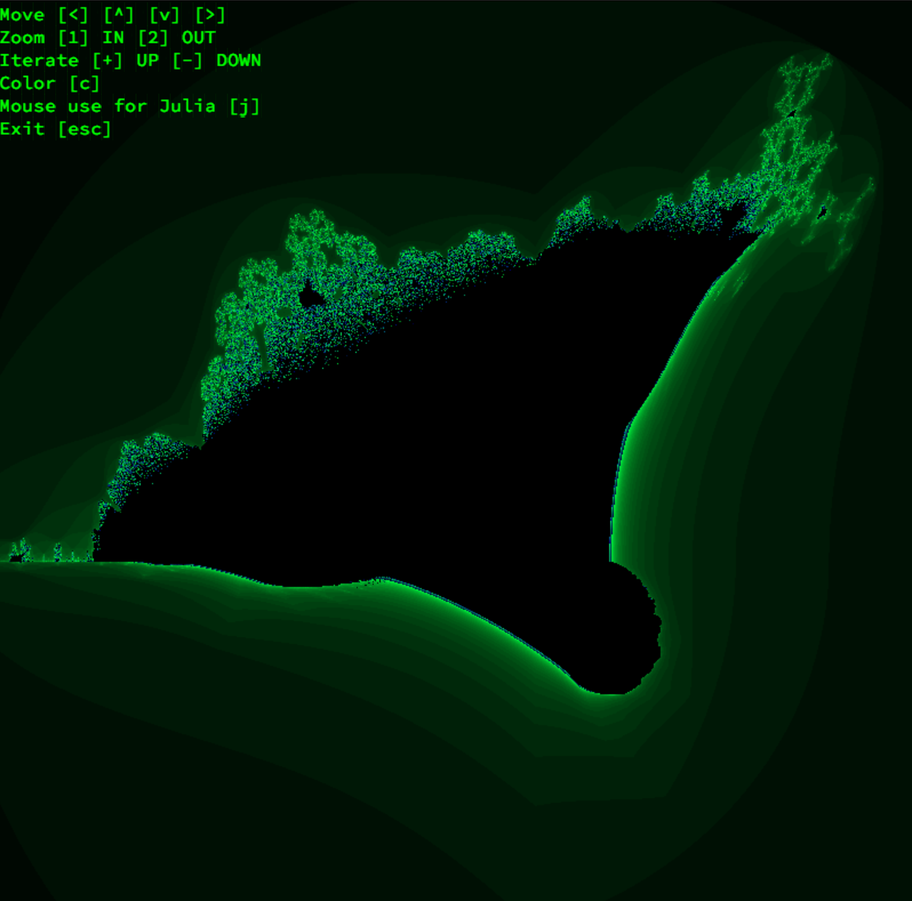

<p align="center">
  <div align="center">
   <br>
  </div>
</p>

# Fract'ol

Fract'ol is a visual representation of a few famous fractol's using their corresponding algorithms.

included:

- Mandelbrot Set
- Julia Set
- Burning Ship

Features:

- Ability to control features with keyboard.
- Visual iterations.
- Steady movement for viewing.
- Ability to zoom in and out.
- Invalid supported fractol error handling.

Additional features:

- Colors.
- Mouse wheel control.
- Responds to mouse movement once activated.
- User guide for controls
- Iteration restriction warning for stability.

Per the project, all of our functions must begin with ```ft_``` for, _Forty-Two_.

**Project Document:**
[Fract'ol.pdf](https://github.com/elloimbrandon/ft_fractol/blob/master/docs/en.subject.pdf)

All functions were written according to 42's coding standard,
[the Norm](https://github.com/elloimbrandon/ft_fractol/blob/master/docs/norme.en.pdf).


## Installation

Download the repository by copying and pasting the commands below.

```bash
git clone https://github.com/elloimbrandon/ft_fractol.git

```

You can compile the library and executable using the Makefile:

Command       |  Action
:-------------|:-------------
`make`        | Compile the library.
`make clean`  | Remove object files.
`make fclean` | Remove object files and the library.
`make re`     | Re-compile the library.

## Usage

After compilation, run executable with valid map file.

```bash
./fractol <map command>
```

Map Command   |  Action
:-------------|:-------------
`mandel`      | Renders Mandelbrot fractol Set.
`julia`       | Renders Julia fractol Set.
`burn_s`      | Renders Burn Ship fractol.



